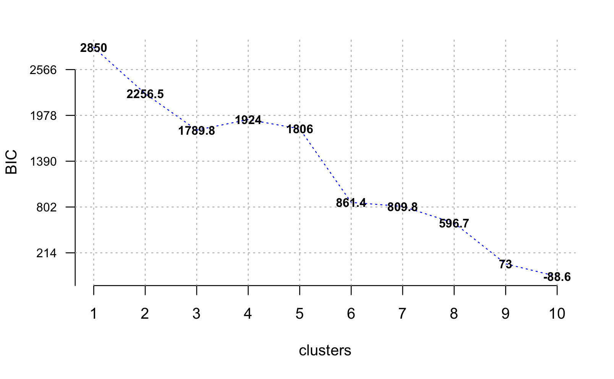
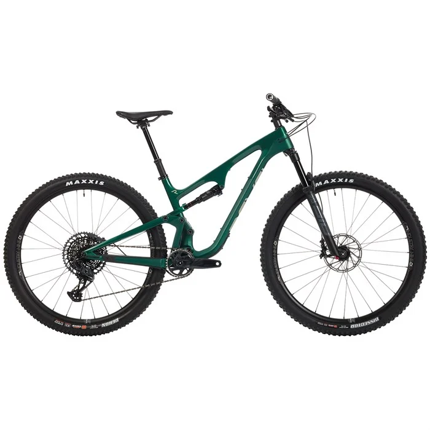

```{r fig.align='center', fig.height=6, fig.width=6, message=FALSE, warning=FALSE, include=FALSE}
# Set our plot and code block specifications for the rest of the document.
knitr::opts_chunk$set(fig.width = 9,
                      fig.height = 6,
                      fig.align = "center",
                      # Set our code specifications for the rest of the document
                      echo = T,
                      warning = F,
                      message = F)

# Turn off scientific notation
options(scipen=999)

# install.packages("pacman")
# Use pacman to load packages. This'll check to see if a package is already installed; if not, it'll install it. If it is installed, it'll run the library() function.
library(pacman)
pacman::p_load(
  readxl, # Used for reading in Excel packages
  tidyverse, # Used for easy data manipulation
  here, # Used for navigating project structures
  kableExtra, # Used for RMarkdown formatting
  DataExplorer, # Used for easy EDA
  corrplot, # Used for correlation plotting
  forcats, # Used for ordering ggplot variables
  ggplot2, # Used for plotting
  gridExtra, # Used for side-by-side plotting
  pander # Pretty printing
  )


# Set our ggplot formats so we don't have to re-type the same code over-and-over again.
theme_set(theme_classic())
theme_update(plot.title = element_text(hjust = 0, color = "slateblue4", size = 20),
  plot.subtitle = element_text(hjust = 0, color = "slateblue2", size = 12),
  plot.caption = element_text(color = "dark gray", size = 10, face = "italic"),
  axis.title.x = element_text(size = 14),
  axis.title.y = element_text(size = 14),
  axis.text.y = element_text(size = 10),
  axis.text.x = element_text(size = 10))

```

# Introduction

## Project Overview

For this project, our team will determine whether the specifications of mountain bikes (MTB) are enough to differentiate between the different types of mountain bike categories.

Currently, full suspension mountain bikes come in multiple categories:

-   **Cross Country (XC)** \| Tend to be the most lightweight, nimble, and designed to put the rider in an efficient pedaling position
-   **Enduro (EN)** \| Heavier frames, more travel and more downhill oriented geometry
-   **Trail (TR)** \| The most common category of bikes, considered to be the halfway point between XC and Enduro
-   **All Mountain (AM)** \| A more niche category which some manufacturers claim to be more downhill focused than trail bikes, but not designed for downhill races like Enduro bikes are
-   **Downcountry (DC)** \| A relatively new category between XC and Trail. Similar to the All Mountain category, these bikes aren't race specific like XC bikes tend to be, but are lighter and faster than trail bikes.

With all of the factors to consider when designing a bike, there are no clear boundaries between these categories. For example, one brand's Downcountry bike could be what another brand considers a Trail bike. The popular mountain biking website PinkBike has done in-depth analyses of many bikes across all categories, and covered the topics of which category bikes should be classified as and of how many categories is sufficient, as seen in the video [here](https://www.youtube.com/watch?v=JYQJbymyG6k&ab_channel=Pinkbike).

**The goal of our project is to determine how many, if any, discrete categories should exist for mountain bikes.** Since most specifications and geometric measurements have one direction when moving across the spectrum of bikes, it's reasonable to believe that these measurements could be reduced to much fewer dimensions, and perhaps even one continuous principle component rather than discrete categories. We can also cluster the bikes together based on some of these specifications and geometric measurements.

As an example, here is a diagram of some of the different types of geometric specifications on mountain bikes:


## The Data

The data was retrieved manually from each of the mountain bike company's websites. All data and associated code for this project is available at the team's corresponding [GitHub repository](https://github.com/mczerwin/MTB-Categorization-Analysis). Let's take a look at the data.

```{r read_data}
# Read in sheet 2 of our data
mtb_data <- read_excel(here::here('Data/mtb_stats.xlsx'), 'Sheet1')
mtb_data <- mtb_data %>% 
  # Clean up the label column
  mutate(label = str_replace_all(str_to_lower(label), '[:punct:]', ''),
         # Create a feature for the long-version of the names
         bike_category = case_when(
          label == 'tr' ~ 'Trail',
          label == 'xc' ~ 'Cross Country',
          label == 'dc' ~ 'Downcountry',
          label == 'am' ~ 'All Mountain',
          label == 'en' ~ 'Enduro',
          TRUE ~ 'red'
        ))

# Pull out the class labels
labels <- mtb_data %>% 
  select(label)


# Let's view the mtb_data output
# In any kable outputs, display NAs as blanks
opts <- options(knitr.kable.NA = "")

mtb_data %>% 
  drop_na('url') %>% 
  head(25) %>%
  # Fix up the headers by replacing the underscores with spaces
  rename_all(funs(str_replace_all(., "_", " "))) %>% 
  # Make everything proper capitalization
  rename_all(funs(str_to_title)) %>%
  kable() %>%
  kable_styling(bootstrap_options = c("striped", "hover"),
                full_width = F,
                font_size = 12) %>%
  # Make the header row bold and black so it's easier to read
  row_spec(0, bold = T, color = "black") %>% 
  scroll_box(height = "400px", width = "100%")
```

------------------------------------------------------------------------

# EDA

In this section, we'll take a look at the `r nrow(mtb_data)` mountain bikes in our dataset and some of the `r ncol(mtb_data)` features. We'll try to break down our understanding of the data in terms of `label`, our target variable that acts as the category for each mountain bike.

## Label (Mountainbike Category)

As stated earlier, there are 5 mountain bike categories in our dataset:

1.  Cross Country (xc)\
2.  Enduro (en)\
3.  Trail (tr)\
4.  All Mountain (am)\
5.  Downcountry (dc)

Let's look at how many of each we have in our dataset.

```{r label_bar_plot}
mtb_data %>% 
  group_by(bike_category) %>% 
  tally() %>% 
  arrange(desc(n)) %>% 
  # Start our visualization, creating our groups by party affiliation
  ggplot(aes(y = forcats::fct_reorder(bike_category, n), x = n)) +
  geom_col(fill = "slateblue", na.rm = T) +
  # Add a label by recreating our data build from earlier
  geom_label(aes(label = n),
             size = 5,
             # Scooch the labels over a smidge
             hjust = .25) +
  # Let's change the names of the axes and title
  xlab("Number of Bikes") +
  ylab("Category (label)") +
  labs(title = "Number of Mountain Bikes per Category")
```

We see that out of our `r nrow(mtb_data)` bikes, most of them are Trail bikes, with the smallest grouping of bikes being all mountain bikes

## Categorical Variables

There are 4 categorical variables we'll take a look at to better understand our data:

1.  Setting\
2.  Size\
3.  Front Piston (`f_piston`)\
4.  Rear Piston (`r_piston`)

```{r categorical_vars}
mtb_data %>% 
  select(-label, -bike_category) %>% 
  DataExplorer::plot_bar(ggtheme = theme_classic(),
                         title = 'Distribution of Categorical Variables',
                         theme_config = theme(plot.title = element_text(hjust = 0, 
                                                                            color = "slateblue4", 
                                                                            size = 24),
                                                  plot.subtitle = element_text(hjust = 0, color = "slateblue2", size = 10),
                                                  plot.caption = element_text(color = "dark gray", size = 10, face = "italic"),
                                                  axis.title.x = element_text(size = 14),
                                                  axis.title.y = element_text(size = 14)),
                         maxcat = 15,
                         ncol = 2)

```

-   We see that only few bikes have a setting value, which is a feature that allows a rider to slightly adjust the frame's geometry to hone in rider comfort. Later on, we'll group by settings for the same bike and average the results to get a more accurate representation of the bikes' specs.\
-   Most of the bikes analyzed have 4 rear/front pistons. The two variables seem to be perfectly in-sync, leading us to believe that they're highly correlated.

But, really, we care about understanding how these different variables interact with our target variable, `label`. Let's look at their distribution and look for any patterns.

```{r categorical_by_label}
mtb_data %>% 
  select(-label) %>% 
  DataExplorer::plot_bar(ggtheme = theme_classic(),
                         by = 'bike_category',
                         by_position = 'fill',
                         title = 'Distribution of Categorical Variables',
                         theme_config = theme(plot.title = element_text(hjust = 0, 
                                                                            color = "slateblue4", 
                                                                            size = 24),
                                                  plot.subtitle = element_text(hjust = 0, color = "slateblue2", size = 10),
                                                  plot.caption = element_text(color = "dark gray", size = 10, face = "italic"),
                                                  axis.title.x = element_text(size = 14),
                                                  axis.title.y = element_text(size = 14)),
                         maxcat = 15,
                         ncol = 2)
```

Here we see:\

-   The size used for most of the bikes is pretty evenly distributed. For the most part, we attempted to find bikes that are sized to the heights of the authors of this report (approx. 5'8"-5'11"), which tended to be Large-sized bikes; however, for some bikes, like Trail, the specific bike's company website from which we pulled the data recommended a Medium-sized bike.\
-   Although most of the bikes have 4-piston brakes, of the bikes that have 2 pistons, most are Cross Country (*xc*) bikes. 4-piston brakes are known to have higher stopping power which is more important the more the rider intends to ride downhill. However, they come at the cost of additional weight, which most XC riders will avoid at all costs.

## Continuous Variables

To analyze the continuous features within our dataset, we built density plots for each of them to better understand their distribution.

```{r continuous_vars}
DataExplorer::plot_density(mtb_data,
                             ggtheme = theme_classic(),
                             title = 'Distribution of Continuous Variables',
                             geom_density_args = list(fill = 'slateblue'),
                             theme_config = theme(plot.title = element_text(hjust = 0, 
                                                                                color = "slateblue4", 
                                                                                size = 24),
                                                      plot.subtitle = element_text(hjust = 0, color = "slateblue2", size = 10),
                                                      plot.caption = element_text(color = "dark gray", size = 10, face = "italic"),
                                                      axis.title.x = element_text(size = 14),
                                                      axis.title.y = element_text(size = 14)),
                             ncol = 3)
```

### \~Normally Distributed Variables:

-   Chainstay_length\
-   Fork_travel\
-   Bb_height\
-   Seat_angle

### Skewed Variables:

-   Head_angle (skewed right)\
-   Handlebar_width (skewed left)\
-   Wheelbase (skewed left)

### Multi-Modal Distributed Variables:

-   f_rotor_dim / r_rotor_dim\
-   Stem_length

Like we did for continuous variables, let's look at the distribution of each of these predictors by our target variable, `label`, to look for any discernible patterns.

```{r cont_by_label}
mtb_data %>% 
  DataExplorer::plot_boxplot(by = 'label',
                             geom_boxplot_args = list('fill' = 'slateblue'),
                           ggtheme = theme_classic(),
                           theme_config = theme(plot.title = element_text(hjust = 0, 
                                                                          color = "slateblue4", 
                                                                          size = 24),
                                                plot.subtitle = element_text(hjust = 0, color = "slateblue2", size = 10),
                                                plot.caption = element_text(color = "dark gray", size = 10, face = "italic"),
                                                axis.title.x = element_text(size = 14),
                                                axis.title.y = element_text(size = 14)),
                           ncol = 3)
```

Here we see:\

-   Cross Country (*xc*) bikes tend to have the largest head angle and smallest seat angle compared to other bikes. They also have the largest stem length by a significant margin. Overall, Cross Country bikes tend to be the most differentiable from other bike categories;\
-   All Mountain (*am*) bikes have a significantly smaller standover height and, along with Enduro (*en*) bikes, have a much larger reach than other bike categories;\
-   As is generally expected, Trail (*tr*) bikes tend to fit mostly in the middle for most of these continuous' variables. This makes sense given that they tend to split the difference between Cross Country and Enduro bikes.

## Average bikes by flip-chip setting

```{r setting}
# Split data based on setting vs. no setting
no_setting <- mtb_data %>% 
  filter(is.na(setting))
setting <- mtb_data %>% 
  filter(!is.na(setting))


setting <- cbind(setting$model, setting$label, select_if(setting, is.numeric))
setting$model <- setting$`setting$model`
setting <- setting %>% select(-`setting$model`)
setting$label <- setting$`setting$label`
setting <- setting %>% select(-`setting$label`)

mean_by_setting <- aggregate(x=select(setting, -c(model, label)),
                             by=list(setting$model, setting$label),
                             FUN=mean)
mean_by_setting$model <- mean_by_setting$Group.1
mean_by_setting$label <- mean_by_setting$Group.2
mean_by_setting <- mean_by_setting %>% select(-c(Group.1, Group.2))

no_setting <- cbind(no_setting$model, no_setting$label, select_if(no_setting, is.numeric))
no_setting$model <- no_setting$`no_setting$model`
no_setting <- no_setting %>% select(-`no_setting$model`)
no_setting$label <- no_setting$`no_setting$label`
no_setting <- no_setting %>% select(-`no_setting$label`)

new_mtb_data <- data.frame(rbind(mean_by_setting, no_setting))

rownames(new_mtb_data) <- new_mtb_data$model

rm(no_setting)
rm(mean_by_setting)
```

Because some bikes' websites would have two different "settings" for the same-sized bike, we opted to include both options and average the two together to get one middle-of-the-road estimate for that type of bike. We end up performing this operation for `r round(100*nrow(setting)/nrow(mtb_data), 0)`% of the bikes in our dataset.

------------------------------------------------------------------------

# Methodology

Now that we have a better understanding of our mountain bike dataset, we'll formulate a plan to prove the following hypothesis:

> **Applying our own clustering algorithms will either give us a different set number of clusters (rather than the 5 pre-ordained categories) OR will not provide clearly defined clusters, leading us to believe that the bikes are actually created on a spectrum and cannot be grouped into one of the 5 pre-ordained categories.**

To do so, we'll:\

-   Try to use various methods to reduce the featureset and see if there are certain variables that can better be used to differentiate between different mountain bike categories.

-   Apply various clustering and classification algorithms, including K-Means Clustering, Gaussian Mixture Models, and Multi-class Support Vector Machine, to disprove the notion that 5 distinct categories of Mountain Bikes exist.

------------------------------------------------------------------------

# Variation Amongst Featureset

The first thing we'll do is look to see if any of the features in our dataset are better at explaining the variation amongst the different bikes than other features. That is, it's completely possible that two features are similar and don't have much variation in them, even across some of the different bike categories. To do so, we'll:

1.  Look for highly correlated features and flag these for potential removal;\
2.  Run Principal Component Analysis (PCA) to see if certain features are better at explaining the variation in our data better than others.

## 1. Correlation

First, let's take a look at our most highly correlated features. We'll use the `corrplot()` function to better order the highly correlated features by the angular order of their eigenvectors.

```{r correlation}
mtb_correlation <- mtb_data %>% 
  # Get rid of price for now
  select(-price) %>% 
  # Select our variables of interest
  select_if(is.numeric) %>% 
  # Build our correlation matrix, such that missing values are handled by casewise deletion
  cor(use = 'complete.obs') 

# Convert our results into a tibble for easier manipulation
mtb_correlation_df <- mtb_correlation %>% 
  as_tibble() %>% 
  mutate(variable = colnames(mtb_correlation)) %>% 
  relocate(variable, everything())

# Build our correlation plot, using the angular order of the eigenvectors
corrplot(mtb_correlation,
         diag = F,
         col = COL2('PRGn'),
         tl.col = 'slateblue4',
         type = 'lower',
         method = 'color',
         order = 'AOE',
         title = 'Mountain Bike Feature Correlation'
         )

```

Here we see some obvious correlations, for example:

-   `f_piston` (front brakes) is perfectly correlated with `r_piston` (rear brakes), which makes sense since mountain bikes tend to use the same types/spec of brakes for the front vs. rear tires.\
-   `fork_travel` has a correlation above .95 with: `r mtb_correlation_df %>% select(variable, fork_travel) %>% filter((fork_travel > .95) | (fork_travel < -.95)) %>% select(variable) %>% as.character()`. This make sense; for example, `rear_travel` *should* be highly correlated with `fork_travel`.

In all, here are the most highly correlated variables (i.e. variables which have a correlation above .9 or below -.9):

```{r high_correlation}
mtb_correlation_df %>% 
  pivot_longer(-variable, 
               names_to = 'correlated_variable', 
               values_to = 'correlation') %>% 
  filter(variable != correlated_variable) %>% 
  # Sort by the absolute value of correlation
  arrange(desc(abs(correlation))) %>% 
  filter((correlation > .90) | (correlation < -.90)) %>% 
  # Get rid of duplicative rows
  dplyr::distinct(correlation, .keep_all = T) %>% 
  pander()

```

There are a solid amount, especially given that we only have `r mtb_data %>% select_if(is.numeric) %>% ncol()` continuous columns in our dataset! For now, we'll opt to include everything. But later on, as we analyze the importance of different features, we'll look to remove some of the above variables first.

## 2. Principal Component Analysis (PCA)

Next, we'll apply PCA to our dataset. In so doing, we'll have to center and scale our data given how different the ranges are for certain measurements. Let's take a look at our 5 principal components which explain the largest proportion of variance in the data:

```{r pca}

# Impute missing values with column mean (not really best practice, but good enough)
for (c in 1:ncol(new_mtb_data)){
  if (is.numeric(unlist(new_mtb_data[,c]))){
    # print(colnames(new_mtb_data)[c])
    new_mtb_data[is.na(new_mtb_data[,c]), c] <- mean(unlist(new_mtb_data[,c]), na.rm=TRUE)  
  }
}

mtb_no_null <- new_mtb_data %>% 
                select(-price) %>%
                select_if(is.numeric) %>% 
                bind_cols(label = new_mtb_data$label) %>%
                drop_na()

mtb_pca <- prcomp(mtb_no_null %>% select(-label),
                  center = TRUE,
                  scale. = TRUE)

# Put our summary results into a dataframe - Justin switching this to cbind() works for me, not sure why
mtb_pca_df <- tibble(variable = c('Standard Deviation', 'Proportion of Variance', 'Cumulative Proportion')) %>% 
  cbind(summary(mtb_pca)$importance)


mtb_pca_df %>% 
  # Only display the first 6 columns
  select(c(PC1:PC5)) %>% 
  pander()

mtb_pca_df %>% 
  # Pivot our data so it's easier to visualize
  pivot_longer(-variable, 
               names_to = 'PC',
               names_prefix = 'PC') %>% 
  # Make the principal component column an integer so ggplot orders it from 1:17 properly
  mutate(PC = as.integer(PC),
         # Convert value to % (multiply by 100) so it's not a decimal
         value = 100*value) %>% 
  filter(variable == 'Proportion of Variance') %>% 
  ggplot(aes(x = PC, y = value)) +
  geom_point(size = 4, color = 'slateblue') +
  geom_line(alpha = .6, lwd = 2, color = 'slateblue') + 
  labs(title = 'Proportion of Variance Explained by Principal Components',
       x = 'Principal Component',
       y = 'Proportion of Variance (%)')

```

We can see that, actually, our 1^st^ principal component alone explains more than half our data. Starting at the 2^nd^ principal component, there's a distinguishable elbow point. After that, we have a huge drop-off. Starting at our 5^th^ principal component, nearly `r 100*round(mtb_pca_df %>% filter(variable == 'Cumulative Proportion') %>% select(PC5) %>% as.numeric(), 3)`% of the data's variation is properly explained. This leads us to believe that the majority of the variation in our data can be explained by using just 1 principal component!

Let's take a look at how our top 2 principal components explain the 5 different mountain bike categories:

```{r pca_viz}
p_load(devtools,
       ggbiplot)

# jpeg('../Images/pca.jpg')

ggbiplot(mtb_pca,
              obs.scale = 1,
              var.scale = 1,
              groups = mtb_no_null$label,
              ellipse = TRUE,
              circle = FALSE,
              ellipse.prob = .5) + 
  theme(legend.direction = 'horizontal',
               legend.position = 'top')

```

Here we can see that our top 2 principal components, which explain roughly `r 100*round(mtb_pca_df %>% filter(variable == 'Cumulative Proportion') %>% select(PC2) %>% as.numeric(), 3)`% of the variation in our data, are already pretty good representations for describing the different components in our dataset. Even so, the groupings are distinctly plotted on the 2-D graph and it is pretty easy to see how the different bike categories (denoted by color) can be explained using a linear transformation of our existing data.

------------------------------------------------------------------------

# Clustering

Because we are investigating the validity of mountain bike categories, one approach is to treat this dataset as unsupervised, stripping the bikes of their `label` and seeing if various clustering algorithms can re-create the 5 distinct `label`s. To do so, we'll take a look at the following algorithms:

-   K-Means
-   Gaussian Mixture Models (GMM)
-   Support Vector Machine (SVM)

## K-Means

We'll start by using the K-Means Clustering algorithm, looking at various numbers of clusters (*k*) and seeing if the bikes logically group together.

```{r}
# How many clusters are necessary? 4?

mtb_numeric <- mtb_no_null %>% 
  select(-label)
mtb_standard_scaled <- scale(mtb_numeric)

mtb_numeric <- mtb_no_null %>% 
  select(-label)

mtb_numeric <- mtb_no_null %>% 
  select(-label)

clusters <- 1:10
dists <- c()
for (c in 1:10){
  km <- kmeans(mtb_standard_scaled, centers=c, iter.max=1000)
  dists <- c(dists, km$tot.withinss)
}

# jpeg('../Images/Kmeans.jpg')
# plot(clusters, dists, type='l', xlab='Clusters', ylab='Total Sum of Squared Euclidean Distances')

# Plot our results
tibble(clusters = clusters,
       dists = dists) %>% 
  ggplot(aes(x = clusters, y = dists)) + 
  geom_point(size = 4, color = 'slateblue') +
  geom_line(alpha = .6, lwd = 2, color = 'slateblue') + 
  labs(title = "K-Means Clustering of MTB Data",
       subtitle = 'Method uses `tot.withinss` parameter to measure distances.',
       x = 'Clusters',
       y = 'Total Sum of Squared Euclidean Distances')

```

```{r}
# Let's see where these clusters would end up on the 2D PCA plot
mtb_pca_scaled <- prcomp(mtb_standard_scaled,
                  center = F,
                  scale. = F)

pca_2_scaled <- as.matrix(mtb_standard_scaled) %*% as.matrix(mtb_pca_scaled$rotation[,1:2])

pca_km_scaled <- kmeans(pca_2_scaled, centers=3, iter.max=1000)


# Bring our PCA and k-means clusters results into our dataset
new_mtb_data %>% 
  cbind(pca_2_scaled) %>% 
  mutate(# Create a feature for the long-version of the names
         bike_category = case_when(
          label == 'tr' ~ 'Trail',
          label == 'xc' ~ 'Cross Country',
          label == 'dc' ~ 'Downcountry',
          label == 'am' ~ 'All Mountain',
          label == 'en' ~ 'Enduro',
          TRUE ~ 'red'
        ),
        # Bring our clusters in as a factor
        cluster = as.factor(pca_km_scaled$cluster)) %>% 
  # GG-plot our shit - lol
  ggplot() +
    geom_point(aes(x = PC1, 
                   y = PC2, 
                   color = cluster, 
                   shape = bike_category), 
               alpha = .9, 
               size = 3) +
    # Add our cluster centers in as well
    geom_point(data = as_tibble(pca_km_scaled$centers) %>%
                 mutate(cluster = as.factor(c(1, 2, 3))), 
               aes(x = PC1, 
                   y = PC2,
                   color = cluster), 
               shape = 10, 
               size = 7) + 
  # Color clusters accordingly
    scale_color_manual(values = c('slateblue4', 'gray', 'slateblue1'), name = 'Cluster') +
    labs(title = "K-Means Clustering of MTB Principal Components",
       subtitle = 'Assigned clusters denoted by color;\nBike categories denoted by shape;\nCluster centers denoted by large cross-hairs shape.',
       x = 'Principal Component 1',
       y = 'Principal Component 2')


#TODO let's look at this bottom cluster - both Niner bikes
# Niner has low reach numbers on its bikes - could be because we used the Medium for these!
# Based on PCA mapping, the blur tr, expic, Exie, Ripley, and Element all have less chainstay length, and less pistons?? wow, should we exclude piston count?? with more 2 piston bikes getting added, it evens out the average, so these aren't showing up as much anymore

```

Above, we attempted to graph the 3 clusters created using top 2 principal components in our data. For example, we can see Cluster #1 on the right-hand side of the chart, mostly composed of Cross Country bikes (triangles in the chart) and some Downcountry bikes (denoted by squares). Downcountry bikes also seem to be part of Cluster #2 (gray points), along with Trail bikes (denoted by squares with an 'x' in them) and some Enduro bikes (denoted by '+'). However, Trail bikes also feature heavily in Cluster #3 along with most of the Enduro bikes.

Overall, it's clear that there is significant overlap between our Clusters, mainly along the Principal Component 1 axis; lending credence to the notion that our bikes can be differentiated along a single, continuous scale.

*Note: In the bottom-right of the graph (`PC2 < -4`), we see two Niner bikes, almost acting as outliers. For a 5'10" rider Niner suggests a size Medium, which results in low reach numbers on its bikes. From the earlier PCA plot, we see that Reach heavily corresponds with PC2, and thus these bikes appear lower on the visual.*

## Gaussian Mixture Model (GMM)

In this section, we'll take a more probabilistic model to our clustering. That is, we'll use a Guassian Mixture Model (GMM) to build out normally distributed subgroupings within our mountain bike dataset, where the densities of each of the subgroupings represents a probability that a bike belongs to that subgrouping. Unlike K-Means, which is a more centroid-based clustering method, GMM is more of a distribution-based clustering method.

Generally, what we expect to see is something like the following:

 where, given a specific type of bike, we can predict the probability, $p(x)$ that a bike belongs to a category like `Cross Country (xc)` vs. `Trail` vs. `Enduro`.

We'll run the `ClusterR::GMM()` function in R to figure out an optimal number of clusters. It uses the expectation-maximization algorithm to perform the probabilistic clustering; at each iteration, it aims to maximize the Bayesian Information Criterion (BIC) to determine an optimal number of clusters.

```{r gmm_search}
p_load(ClusterR)


opt_gmm <- Optimal_Clusters_GMM(mtb_standard_scaled, 
                     max_clusters = 10, 
                     criterion = "BIC", 
                     dist_mode = "eucl_dist", 
                     seed_mode = "random_subset",
                     km_iter = 10, 
                     em_iter = 10, 
                     var_floor = 1e-10, 
                     verbose = T,
                     plot_data = T)
```



From the plot above, we see that the BIC value decreases *generally* as the number of clusters increases. However, it appears that the first big drop is when `clusters = 3`. Let's try that value out and see which bike categories get mapped into each of the 3 clusters.

```{r gmm_optimal}

# Build our GMM model
mtb_gmm <- GMM(mtb_standard_scaled,
               gaussian_comps = 3,
               dist_mode = 'maha_dist', # Distance metric to use during seeding of initial means clustering
               seed_mode = 'random_subset', # How initial means are seeded prior to EM alg
               km_iter = 10, # Num of iterations of K-Means alg
               em_iter = 10, # Num of iterations of EM alg
               verbose = F
               )

# Run our predictions and convert it to a dataframe
mtb_gmm_pred <- predict_GMM(mtb_standard_scaled, 
                            mtb_gmm$centroids, 
                            mtb_gmm$covariance_matrices, 
                            mtb_gmm$weights) 

mtb_gmm_pred <- tibble('log_likelihood_c1' = mtb_gmm_pred$log_likelihood[, 1], 
                         'log_likelihood_c2' = mtb_gmm_pred$log_likelihood[, 2],  
                         'log_likelihood_c3' = mtb_gmm_pred$log_likelihood[, 3], 
                         'cluster1_prob' = mtb_gmm_pred$cluster_proba[, 1], 
                         'cluster2_prob' = mtb_gmm_pred$cluster_proba[, 2], 
                         'cluster3_prob' = mtb_gmm_pred$cluster_proba[, 3], 
                         'cluster_labels' = mtb_gmm_pred$cluster_labels)

mtb_gmm_pred %>% 
  select(cluster_labels) %>% 
  bind_cols(label = mtb_no_null$label) %>% 
  # xtabs(~ ., data = .) %>% 
  table() %>% 
  bind_cols(cluster_labels = c('1', '2', '3')) %>% 
  relocate(cluster_labels, everything()) %>% 
  pander()
```

Here we see the predicted cluster labels along with the actual 5 bike categories in our data. Trail and Enduro bikes are mostly grouped into Clusters 1 and 2, while Downcountry and Cross Country bikes are grouped into Cluster 3. This would lead us to believe that the original 5 bike categories can be sufficiently explained with fewer clusters.

Even so, let's see how the probability of each bike belonging to a cluster appears by looking at the densities of each of the associated probabilities for a bike belonging to one of the cluster labels.

```{r gmm_plots}
# Plot the densities for our clusters
cluster1_pred <-  mtb_gmm_pred %>% 
  filter(cluster_labels == 1) %>%
  ggplot(aes(x = cluster1_prob, y=..scaled..)) +
  # Plot the density and adjust the curvature so it looks better
  geom_density(position = 'stack', alpha = .1, fill = 'slateblue', color = 'slateblue', adjust = 10) +
  labs(title = 'Cluster 1',
       x = 'Probability',
       y = 'Density')

  
cluster2_pred <-  mtb_gmm_pred %>% 
  filter(cluster_labels == 2) %>%
  ggplot(aes(x = cluster2_prob, y=..scaled..)) +
  # Plot the density and adjust the curvature so it looks better
  geom_density(position = 'stack', alpha = .1, fill = 'slateblue', color = 'slateblue', adjust = 25) +
  labs(title = 'Cluster 2',
       x = 'Probability',
       y = 'Density')

cluster3_pred <- mtb_gmm_pred %>% 
  filter(cluster_labels == 3) %>%
  ggplot(aes(x = cluster3_prob, y=..scaled..)) +
  # Plot the density and adjust the curvature so it looks better
  geom_density(position = 'stack', alpha = .1, fill = 'slateblue', color = 'slateblue', adjust = 250) +
  labs(title = 'Cluster 3',
       x = 'Probability',
       y = 'Density')

gridExtra::grid.arrange(cluster1_pred, cluster2_pred, cluster3_pred, ncol = 3)


```

Above, we see the expected probability associated with predicting a correct class label. That is, the graph on the left shows how accurate the 3-cluster Gaussian Mixture Model was for predicting bikes fitting into Cluster #1. Generally, the probabilities for the predictions are all above .95; that is, GMM is extremely confident in grouping the different bikes into these 3 clusters.

## Multi-class SVM

If we took a slightly different approach and opted to treat our pre-assigned `label`s as truth, then we could approach this analysis as a supervised learning problem. 

For this section, we chose to group the All Mountain and Enduro categories, since they completely overlapped in the PCA chart earlier. We also chose to switch the categorization of the Downcountry category, leaving it as a separate category and grouping it with both Trail and XC to experiment with the results of the model.

We chose to use a Multi-Class Support Vector Machine (SVM), and a grid search to tune the kernel functions and $\gamma$ values. For each set of parameters, we used 10-fold cross validation on all rows of the data. We decided against holding out data as a test set since we have such limited data, and the 10-fold CV should evaluate the model's performance on blind data.

```{r}
p_load(e1071,
       caret)

#convert all mountain category to enduro, dc -> Xc?
remap <- function(x, num){
  if (x=='am' || x=='en'){
    if (num){
      return(4)
    }
    else{
      return('Enduro')
    }
  }
  else if(x=='xc'){
    if(num){
      return(1)
    }
    else{
      return('Cross Country')
    }
  }
  else if(x=='dc'){
    if(num){
      return(2)
    }
    else{
      return('Downcountry')
    }
  }
  else if(x=='tr'){
    if(num){
      return(3)
    }
    else{
      return('Trail')
    }
  }
}
labels <- as.factor(unlist(lapply(new_mtb_data$label, remap, F)))


trainSVM <- function(x, y, idx, k='radial basis', g=0){
  xtest <- x[idx,]
  xtrain <- x[-idx,]
  ytest <- y[idx]
  ytrain <- y[-idx]
  
  if(k=='linearl'){
    clf <- svm(x=xtrain, y=ytrain, kernel=k)
  }
  else{
    if (g==0){
      clf <- svm(x=xtrain, y=ytrain, kernel=k)
    }
    else{
      clf <- svm(x=xtrain, y=ytrain, kernel=k, gamma=g)
    }
  }
  
  preds <- predict(clf, xtest)
  
  acc <- 0
  cm <- table(ytest, preds)
  for (i in 1:length(unique(labels))){
    acc <- acc + cm[i,i]
  }
  return(acc/sum(cm))
}


# Roughly 66.6% accuracy when treating down country as separate category
# But - roughly 68.8% accuracy when treating down country as XC, only 69% accuracy when treating downcountry as trail, suggests that downcountry bikes are more akin to trail than they are XC

folds <- createFolds(labels, k=10)


#Grid Search for SVM
kernels <- c('linear', 'polynomial', 'radial', 'sigmoid')
gammas <- seq(-5, 3, length.out=100)
gammas <- 10^gammas


#Change these below
X = pca_2_scaled
# X = mtb_standard_scaled
y = labels

results <- matrix(ncol=3, nrow=0)
colnames(results) <- c('acc', 'kernel', 'gamma')

for (k in kernels){
  if (k=='linear'){
    
    folds <- createFolds(labels, k=10)
    accs <- c()
    for (fold in folds){
      # print('here')
      acc <- trainSVM(X, y, fold, k='linear', g=0)
      accs <- c(accs, acc)
    }
    results <- rbind(results, c(mean(accs), k, 0))
  }
  else{
    for (g in gammas){
      # print('choosing gamma')
      # print(k)
      folds <- createFolds(labels, k=10)
      accs <- c()
      for (fold in folds){
        acc <- trainSVM(pca_2_scaled, labels, fold, k=k, g=0)
        accs <- c(accs, acc)
      }
    results <- rbind(results, c(mean(accs), k, g))
    }
  }
}

# results <- data.frame(results)
# results$acc <- as.numeric(results$acc)
# results$gamma <- as.numeric(results$gamma)
# results[which.max(results$acc), ]
# 
# 
# nonlinear_svm <- results[-(results$kernel=='linear'), ]
# 
# nonlinear_svm[which.max(nonlinear_svm$acc), ]
# On two axis, the best svm model is linear

```

Using all of the data, the best SVM model was 73% accurate, using a Radial Basis kernel function with $\gamma=2.595024$

Treating the Downcountry category as XC, the best model was 81.6% accurate, with a Radial Basis kernel function with $\gamma=0.02983647$

Treating the Downcountry category as Trail, the best model was 80.0% accurate with a Radial Basis kernel function with $\gamma=3.764936$

Logically, grouping Downcountry bikes with one of their adjacent categories should naturally lead to an increase in performance; however, this could suggest that the Downcountry category is slightly more skewed towards the XC bikes.

To visualize the results of the SVM classifier, we mapped all features to the 2 Principal Components. In so doing, we were able to achieve a higher accuracy of 75% using a linear kernel, while continuing to treat the Downcountry category as its own distinct category.

```{r}
## This cell only to visualize linear kernel
pcsvm <- svm(x=pca_2_scaled, y=labels, kernel='linear', gamma=0.2782559	)

dat <- data.frame(pca_2_scaled)

grid <- expand.grid(seq(min(dat[, 1]),max(dat[,1]),length.out=100),seq(min(dat[,2]),max(dat[,2]),length.out=100)) 
names(grid) <- names(dat)[1:2]
preds <- predict(pcsvm, grid)
df <- data.frame(grid, preds)

# ggplot(df, aes(x = PC1, y = PC2)) + 
#   geom_tile(aes(fill=preds)) +
#   geom_point(data = dat, aes(shape = labels), size = 2) + 
#   labs(title = "Support Vector Machine Classification",
#          x = 'Principal Component 1',
#          y = 'Principal Component 2')

ggplot(df, aes(x = PC1, y = PC2)) + 
  geom_tile(aes(fill = preds), alpha = .2) +
  scale_fill_manual(values = c('slateblue', 'green', 'gray', 'slateblue4'), name = 'Predictions') +
  geom_point(data = dat, aes(shape = labels, color = labels), size = 2) + 
  scale_color_manual(values = c('slateblue', 'green', 'gray', 'slateblue4')) +
  labs(title = "Support Vector Machine Classification",
         x = 'Principal Component 1',
         y = 'Principal Component 2')


```

In the chart above, we can see how SVM closely maps the actual labels of the bike categories to their predicted categories. There are some misclassifications (when different colored dots appear in a differently shaded region), but overall the shaded SVM feature spaces seem to be accurate representations of the bike categories. 

An interesting observation is that most of the boundary lines are more or less vertical, suggesting that most of the variation between classes is along Principal Component 1. We see this deviate between the XC and Downcountry boundary, however the validity of this boundary is still in question since the Downcountry category itself is more or less unofficial. Let's try remapping Downcountry bikes to the Cross Country (XC) category and review the updated results.

```{r}
# DC as XC, using Linear
remap2 <- function(x, num){
  if (x=='am' || x=='en'){
    if (num){
      return(4)
    }
    else{
      return('Enduro')
    }
  }
  else if(x=='xc' || x=='dc'){
    if(num){
      return(1)
    }
    else{
      return('Cross Country')
    }
  }
  else if(x=='tr'){
    if(num){
      return(3)
    }
    else{
      return('Trail')
    }
  }
}
labels2 <- as.factor(unlist(lapply(new_mtb_data$label, remap2, F)))

pcsvm2 <- svm(x=pca_2_scaled, y=labels2, kernel='linear')

preds2 <- predict(pcsvm2, grid)
df2 <- data.frame(grid, preds2)


ggplot(df2, aes(x = PC1, y = PC2)) + 
  geom_tile(aes(fill = preds2), alpha = .2) +
  scale_fill_manual(values = c('slateblue', 'gray', 'green'), name = 'Predictions') +
  geom_point(data = dat, aes(shape = labels2, color = labels2), size = 2) + 
  scale_color_manual(values = c('slateblue', 'gray', 'green')) +
  labs(title = "Support Vector Machine Classification",
         x = 'Principal Component 1',
         y = 'Principal Component 2')

```

Mapping all Downcountry bikes to XC, the boundaries become almost entirely vertical, again suggesting that the classification of bikes can be attributed to Principal Component 1. The distinct regions appear to be accurate predictors of the 3 bike categories and are simple to explain, which would mean that we have effectively reduced the bias in our model.

------------------------------------------------------------------------

# Conclusions

## Findings

-   All results suggest that trying to discretely categorize full suspension mountain bikes is more or less arbitrary.

-   The categorization of a mountain bike should be treated as on a continuous scale, with Cross Country (XC) bikes on one end and Enduro (EN) bikes on another.

-   To obtain where a specific bike lies on this scale, one can use the linear combination of the bike's specifications and the first principal component.

-   This new spectrum of mapping bikes can provide bike manufacturers and consumers a method to quantify how a bike will handle when ridden.

Let's look at an example from the data above. Some bike companies, like Transition and Revel, do not explicitly categorize their bikes like others do. For these brands, we categorized them based on general attributes, as well as media coverage of them. Let's take a look at the Revel Ranger:



| Rear Travel | Fork Travel | Front Piston | Front Rotor Diameter | Rear Piston | Rear Rotor Diameter | Head Angle | Seat Angle | Crank Length | Stem Length | Handlebar Width | Reach | Stack | Wheelbase | Chainstay Length | Bottom Bracket Height | Standover Height |
|-----|-----|-----|-----|-----|-----|-----|-----|-----|-----|-----|-----|-----|-----|-----|-----|-----|
| 115         | 120         | 2            | 180                  | 2           | 160                 | 67.5       | 75.3       | 170          | 40          | 780             | 473   | 619   | 1194      | 436              | 338                   | 699              |

Converting to an input vector: 
$$ 
\text{Ranger} = \begin{bmatrix}  115 \\ 120 \\ 2 \\ 180 \\ 2 \\ 160 \\ 67.5 \\ 75.3 \\ 170 \\ 40 \\ 780 \\ 473 \\ 619 \\ 1194 \\ 436 \\ 338 \\ 699 \end{bmatrix} \rightarrow \text{   Ranger (scaled)} = \begin{bmatrix}    -0.61 \\ -0.80 \\   -1.68  \\ -0.53  \\ -1.68 \\ -1.30 \\  0.79  \\ -0.39  \\ -0.40 \\-1.15 \\-0.11 \\0.60 \\0.16 \\-0.33 \\0.16 \\-0.16 \\  -1.01 \end{bmatrix} \text{and PC1}=\begin{bmatrix} -0.31 \\  -0.31
        \\ -0.23 \\
      -0.26\\
         -0.23\\
      -0.27\\
        0.30\\
       -0.26\\
     -0.01\\
       0.24\\
  -0.27\\
            -0.17\\
            -0.26\\
        -0.30\\
 -0.13\\
        -0.25\\
  0.08\end{bmatrix}
$$

$$ 
\text{Ranger} \times \text{PC1} = 1.7
$$

Mapping the Revel Ranger to its first Principal Component we get a value of 1.7 which puts us right around the boundary between Trail and XC, which lines up with the PinkBike editors' labelling of Downcountry in the [video](https://www.youtube.com/watch?v=JYQJbymyG6k) mentioned in the Project Overview section.

```{r eval=FALSE, include=FALSE}
#Get Ranger stats
mtb_numeric['ranger',]

# Get Scaled Ranger
length(mtb_standard_scaled['ranger', ])
length(as.matrix(mtb_pca_scaled$rotation[,1]))
# Get PC 1

round(mtb_standard_scaled['ranger', ] %*% as.matrix(mtb_pca_scaled$rotation[,1]),2)
pca_2_scaled
```

## Opportunities for Improved Analysis

There are a few opportunities to improve the analysis included in this presentation and forthcoming report:

-   **Inclusion of more bikes (rows)** \| The most obvious improvement we can make is to add more data points to our dataset. The data for each individual bike was manually entered by one of the authors of this report. After entering data for bikes of most major bike brands, we had enough data to accurately visualize the different bike categories; however, with more bikes, our algorithms will become more robust and less affected by the presence of outliers.

-   **Inclusion of more bike features (columns)** \| Although we included the most meaningful specs/geometry of the bikes analyzed, there are dozens of other, smaller features that can be used to help differentiate between different types of bikes.

-   **Include all sizes of bikes** \| We chose to use the size that corresponded to a 5'10" rider, but some bike manufacturers could interpret this as a Medium while others interpret this as a Large.

-   **Include bikes across multiple years** \| As bike trends slowly change, it'd be interesting to see how the data shifts across time. For example, the Rocky Mountain Element reduced its head angle from 70 degrees to 65.8 in one iteration of the bike. Including data from past years could provide valuable market insights into how the industry as a whole is moving.

## Lessons Learned

As both authors of this report are in the midst of the [Online Masters of Science of Analytics (OMSA)](https://pe.gatech.edu/degrees/analytics) program, we feel that it provided reinforcement on previously seen data mining topics as well as good introductions to net new topics. Here are some individual takes on the lessons learned from the course.

**Mike:** I think this course was a great complement to [ISYE6740, Computational Data Analytics](https://www2.isye.gatech.edu/~yxie77/ISyE6740SyllabusSpring2018.pdf) (CDA), which was a bit more theory focused, e.g. requiring us to build ML algorithms from scratch, while this course seemed more practical focused, e.g. HW 5 allowing us to use machine learning methods on any dataset of our choice. Additionally, I think this course was a good course to take concurrently with Data Visual Analytics, as it also required the use of Random Forests, and provided a good introduction to data analysis techniques that are standard across any project (e.g. cross validation).

**Justin:** I really appreciated the practical nature of this course. I've already had the opportunity to use some of the classification and machine learning algorithms at work. Although this is a different take on ISYE 6740, Computational Data Analytics (CDA), I appreciated getting to do a similar-style course in my programming language of choice (R) and to get to really dive into the actual code, which has already paid numerous dividends in a practical setting. I took this course concurrently with [ISYE 6414](https://www.studocu.com/en-us/document/georgia-institute-of-technology/regression-analysis/isy-e-6414-syllabus-spring-2022/23788135), Regression Analysis. Although 6414 was recommended as a prerequisite for this course, it ended up being a nice pairing of courses.

## Course Suggestions

This course was a good introduction for practical applications. Some areas of improvement we would like to see included:

-   Requiring more fundamental knowledge checks for some material. More specifically, we think the topics around Information Criterion and Discriminant analysis were glossed over too quickly. This course was our first exposure to those topics, so we're not sure if they were intentionally light on the material since they are not used in industry as much.

-   Additionally, we think the assignments in this course could have been more clear, however, we also think this could have been intentional to mimic the ambiguity of working in industry.

-   A lot of the quizzes ended up needing (or at least seriously benefiting from) pre-written code based on the knowledge checks. Writing the code was fun to make the quizzes more bearable; however, we would've loved to see the instructor/TAs post this kind of code after the quiz due dates so students could benefit from understanding how to solve the problems in R.
