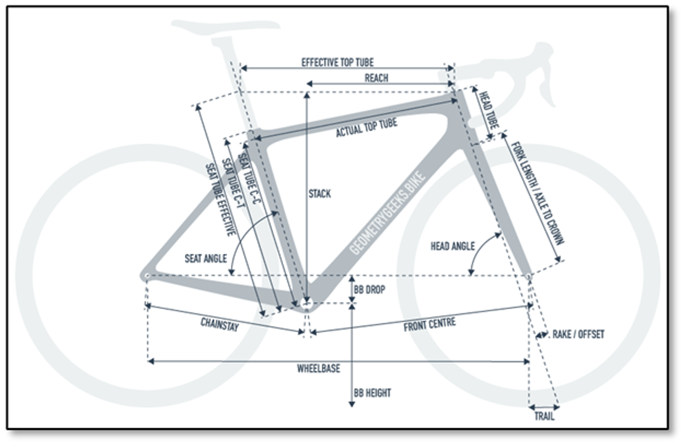
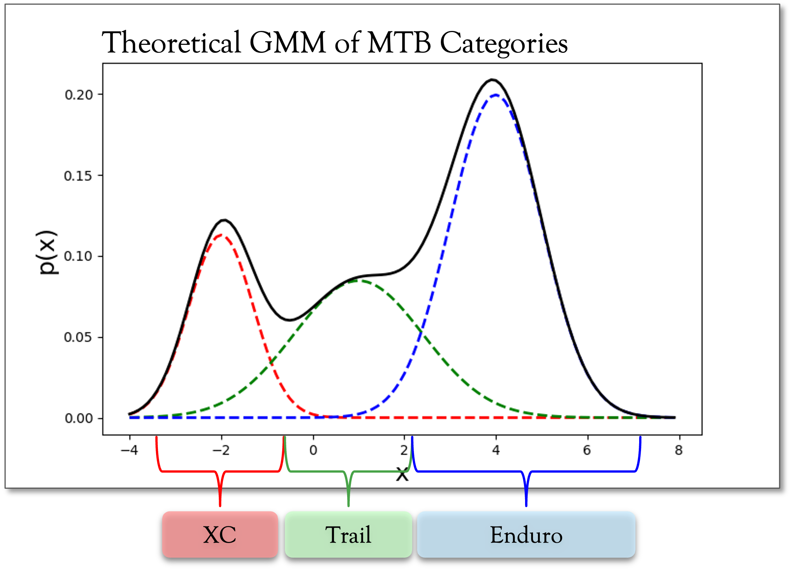

```{r fig.align='center', fig.height=6, fig.width=6, message=FALSE, warning=FALSE, include=FALSE}
# Set our plot and code block specifications for the rest of the document.
knitr::opts_chunk$set(fig.width = 9,
                      fig.height = 6,
                      fig.align = "center",
                      # Set our code specifications for the rest of the document
                      echo = T,
                      warning = F,
                      message = F)

# Turn off scientific notation
options(scipen=999)

# install.packages("pacman")
# Use pacman to load packages. This'll check to see if a package is already installed; if not, it'll install it. If it is installed, it'll run the library() function.
library(pacman)
pacman::p_load(
  readxl, # Used for reading in Excel packages
  tidyverse, # Used for easy data manipulation
  here, # Used for navigating project structures
  kableExtra, # Used for RMarkdown formatting
  DataExplorer, # Used for easy EDA
  corrplot, # Used for correlation plotting
  forcats, # Used for ordering ggplot variables
  pander # Pretty printing
  )


# Set our ggplot formats so we don't have to re-type the same code over-and-over again.
theme_set(theme_classic())
theme_update(plot.title = element_text(hjust = 0, color = "slateblue4", size = 20),
  plot.subtitle = element_text(hjust = 0, color = "slateblue2", size = 12),
  plot.caption = element_text(color = "dark gray", size = 10, face = "italic"),
  axis.title.x = element_text(size = 14),
  axis.title.y = element_text(size = 14),
  axis.text.y = element_text(size = 10),
  axis.text.x = element_text(size = 10))

```

# Introduction

## Project Overview
For this project, our team will determine whether the specifications of mountain bikes (MTB) are enough to differentiate between the different types of mountain bike categories.

Currently, full suspension mountain bikes come in multiple categories:

-   **Cross Country (XC)** \| Tend to be the most lightweight, nimble, and designed to put the rider in an efficient pedaling position
-   **Enduro (EN)** \| Heavier frames, more travel and more downhill oriented geometry
-   **Trail (TR)** \| The most common category of bikes, considered to be the halfway point between XC and Enduro
-   **All Mountain (AM)** \| A more niche category which some manufacturers claim to be more downhill focused than trail bikes, but not designed for downhill races like Enduro bikes are
-   **Downcountry (DC)** \| A relatively new category between XC and Trail. Similar to the All Mountain category, these bikes aren't race specific like XC bikes tend to be, but are lighter and faster than trail bikes.

With all of the factors to consider when designing a bike, there are no clear boundaries between these categories. For example, one brand's Downcountry bike could be what another brand considers a Trail bike.

**The goal of our project is to determine how many, if any, discrete categories should exist for mountain bikes.** Since most specifications and geometric measurements have one direction when moving across the spectrum of bikes, it's reasonable to believe that these measurements could be reduced to much fewer dimensions, and perhaps even one continuous principle component rather than discrete categories. Here is a diagram of some of the different types of geometric specifications on mountain bikes:



## The Data
The data was retrieved manually from each of the mountain bike company's websites. Let's take a look at the data.

```{r read_data}
# Read in sheet 2 of our data
mtb_data <- read_excel(here::here('Data/mtb_stats.xlsx'), 'Sheet1')
mtb_data <- mtb_data %>% 
  # Clean up the label column
  mutate(label = str_replace_all(str_to_lower(label), '[:punct:]', ''),
         # Create a feature for the long-version of the names
         bike_category = case_when(
          label == 'tr' ~ 'Trail',
          label == 'xc' ~ 'Cross Country',
          label == 'dc' ~ 'Downcountry',
          label == 'am' ~ 'All Mountain',
          label == 'en' ~ 'Enduro',
          TRUE ~ 'red'
        ))

# Pull out the class labels
labels <- mtb_data %>% 
  select(label)


# Let's view the mtb_data output
# In any kable outputs, display NAs as blanks
opts <- options(knitr.kable.NA = "")

mtb_data %>% 
  head(25) %>%
  # Fix up the headers by replacing the underscores with spaces
  rename_all(funs(str_replace_all(., "_", " "))) %>% 
  # Make everything proper capitalization
  # rename_all(funs(str_to_title)) %>% 
  kable() %>%
  kable_styling(bootstrap_options = c("striped", "hover"),
                full_width = F,
                font_size = 12) %>%
  # Make the header row bold and black so it's easier to read
  row_spec(0, bold = T, color = "black") %>% 
  scroll_box(height = "400px", width = "100%")
```

------------------------------------------------------------------------

# EDA

In this section, we'll take a look at the `r nrow(mtb_data)` mountain bikes in our dataset and some of the `r ncol(mtb_data)` features. We'll try to break down our understanding of the data in terms of `label`, our target variable that acts as the category for each mountain bike.

## Label (Mountainbike Category)

As stated earlier, there are 5 mountain bike categories in our dataset:

1.  Cross Country (xc)\
2.  Enduro (en)\
3.  Trail (tr)\
4.  All Mountain (am)\
5.  Downcountry (dc)

Let's look at how many of each we have in our dataset.

```{r label_bar_plot}
mtb_data %>% 
  group_by(bike_category) %>% 
  tally() %>% 
  arrange(desc(n)) %>% 
  # Start our visualization, creating our groups by party affiliation
  ggplot(aes(y = forcats::fct_reorder(bike_category, n), x = n)) +
  geom_col(fill = "slateblue", na.rm = T) +
  # Add a label by recreating our data build from earlier
  geom_label(aes(label = n),
             size = 5,
             # Scooch the labels over a smidge
             hjust = .25) +
  # Let's change the names of the axes and title
  xlab("Number of Bikes") +
  ylab("Category (label)") +
  labs(title = "Number of Mountain Bikes per Category")
```

We see that out of our `r nrow(mtb_data)` bikes, most of them are Trail bikes, with the smallest grouping of bikes being all mountain bikes

## Categorical Variables

There are 4 categorical variables we'll take a look at to better understand our data:

1.  Setting\
2.  Size\
3.  Front Piston (`f_piston`)\
4.  Rear Piston (`r_piston`)

```{r categorical_vars}
mtb_data %>% 
  select(-label, -bike_category) %>% 
  DataExplorer::plot_bar(ggtheme = theme_classic(),
                         title = 'Distribution of Categorical Variables',
                         theme_config = theme(plot.title = element_text(hjust = 0, 
                                                                            color = "slateblue4", 
                                                                            size = 24),
                                                  plot.subtitle = element_text(hjust = 0, color = "slateblue2", size = 10),
                                                  plot.caption = element_text(color = "dark gray", size = 10, face = "italic"),
                                                  axis.title.x = element_text(size = 14),
                                                  axis.title.y = element_text(size = 14)),
                         maxcat = 15,
                         ncol = 2)

```

-   We see that most of the bikes don't have a setting, which is used to help differentiate between different versions of the same bike. Later on, we'll group by settings for the same bike and average the results to get a more accurate representation of the bikes' specs.\
-   Most of the bikes analyzed have 4 rear/front pistons. The two variables seem to be perfectly in-sync, leading us to believe that they're highly correlated.

But, really, we care about understanding how these different variables interact with our target variable, `label`. Let's look at their distribution and look for any patterns.

```{r categorical_by_label}
mtb_data %>% 
  DataExplorer::plot_bar(ggtheme = theme_classic(),
                         by = 'label',
                         by_position = 'fill',
                         title = 'Distribution of Categorical Variables',
                         theme_config = theme(plot.title = element_text(hjust = 0, 
                                                                            color = "slateblue4", 
                                                                            size = 24),
                                                  plot.subtitle = element_text(hjust = 0, color = "slateblue2", size = 10),
                                                  plot.caption = element_text(color = "dark gray", size = 10, face = "italic"),
                                                  axis.title.x = element_text(size = 14),
                                                  axis.title.y = element_text(size = 14)),
                         maxcat = 15,
                         ncol = 2)
```

Here we see:\

-   The size used for most of the bikes is pretty evenly distributed. For the most part, we attempted to find bikes that are sized to the heights of the authors of this report (approx. 5'8"-5'11"), which tended to be Large-sized bikes; however, for some bikes, like Trail, the specific bike's company website from which we pulled the data recommended a Medium-sized bike.\
-   Although most of the bikes are 4-piston bikes, of the bikes that have 2 pistons, most are Cross Country (*xc*) bikes.

## Continuous Variables

To analyze the continuous features within our dataset, we built density plots for each of them to better understand their distribution.

```{r continuous_vars}
DataExplorer::plot_density(mtb_data,
                             ggtheme = theme_classic(),
                             title = 'Distribution of Continuous Variables',
                             geom_density_args = list(fill = 'slateblue'),
                             theme_config = theme(plot.title = element_text(hjust = 0, 
                                                                                color = "slateblue4", 
                                                                                size = 24),
                                                      plot.subtitle = element_text(hjust = 0, color = "slateblue2", size = 10),
                                                      plot.caption = element_text(color = "dark gray", size = 10, face = "italic"),
                                                      axis.title.x = element_text(size = 14),
                                                      axis.title.y = element_text(size = 14)),
                             ncol = 3)
```

### \~Normally Distributed Variables:

-   Chainstay_length\
-   Fork_travel\
-   Bb_height\
-   Seat_angle

### Skewed Variables:

-   Head_angle (skewed right)\
-   Handlebar_width (skewed left)\
-   Wheelbase (skewed left)

### Multi-Modal Distributed Variables:

-   f_rotor_dim / r_rotor_dim\
-   Stem_length

Like we did for continuous variables, let's look at the distribution of each of these predictors by our target variable, `label`, to look for any discernible patterns.

```{r cont_by_label}
mtb_data %>% 
  DataExplorer::plot_boxplot(by = 'label',
                             geom_boxplot_args = list('fill' = 'slateblue'),
                           ggtheme = theme_classic(),
                           theme_config = theme(plot.title = element_text(hjust = 0, 
                                                                          color = "slateblue4", 
                                                                          size = 24),
                                                plot.subtitle = element_text(hjust = 0, color = "slateblue2", size = 10),
                                                plot.caption = element_text(color = "dark gray", size = 10, face = "italic"),
                                                axis.title.x = element_text(size = 14),
                                                axis.title.y = element_text(size = 14)),
                           ncol = 3)
```

Here we see:\

-   Cross Country (*xc*) bikes tend to have the largest head angle and smallest seat angle compared to other bikes. They also have the largest stem length by a significant margin. Overall, Cross Country bikes tend to be the most differentiable from other bike categories;\
-   All Mountain (*am*) bikes have a significantly smaller standover height and, along with Enduro (*en*) bikes, have a much larger reach than other bike categories;\
-   As is generally expected, Trail (*tr*) bikes tend to fit mostly in the middle for most of these continuous' variables. This makes sense given that they tend to split the difference between Cross Country and Enduro bikes.

## Average bikes by flip-chip setting

Because some bikes' websites would have two different "settings" for the same-sized bike, we opted to include both options and average the two together to get one middle-of-the-road estimate for that type of bike.

```{r setting}
# Split data based on setting vs. no setting
no_setting <- mtb_data %>% 
  filter(is.na(setting))
setting <- mtb_data %>% 
  filter(!is.na(setting))


setting <- cbind(setting$model, setting$label, select_if(setting, is.numeric))
setting$model <- setting$`setting$model`
setting <- setting %>% select(-`setting$model`)
setting$label <- setting$`setting$label`
setting <- setting %>% select(-`setting$label`)

mean_by_setting <- aggregate(x=select(setting, -c(model, label)),
                             by=list(setting$model, setting$label),
                             FUN=mean)
mean_by_setting$model <- mean_by_setting$Group.1
mean_by_setting$label <- mean_by_setting$Group.2
mean_by_setting <- mean_by_setting %>% select(-c(Group.1, Group.2))

no_setting <- cbind(no_setting$model, no_setting$label, select_if(no_setting, is.numeric))
no_setting$model <- no_setting$`no_setting$model`
no_setting <- no_setting %>% select(-`no_setting$model`)
no_setting$label <- no_setting$`no_setting$label`
no_setting <- no_setting %>% select(-`no_setting$label`)

new_mtb_data <- data.frame(rbind(mean_by_setting, no_setting))

rownames(new_mtb_data) <- new_mtb_data$model


```

Because some bikes' websites would have two different "settings" for the same-sized bike, we opted to include both options and average the two together to get one middle-of-the-road estimate for that type of bike. We end up performing this operation for `r round(100*nrow(setting)/nrow(mtb_data), 0)`% of the bikes in our dataset.

------------------------------------------------------------------------

# Methodology

Now that we have a better understanding of our mountain bike dataset, we'll formulate a plan to prove the following hypothesis:

> **Applying our own clustering algorithms will either give us a different set number of clusters (rather than the 5 pre-ordained categories) OR will not provide clearly defined clusters, leading us to believe that the bikes are actually created on a spectrum and cannot be grouped into one of the 5 pre-ordained categories.**

To do so, we'll:\
- Try to use various methods to reduce the featureset and see if there are certain variables that can better be used to differentiate between different mountain bike categories. - Apply various clustering and classification algorithms, including K-Means Clustering, Gaussian Mixture Models, and Multi-class Support Vector Machine, to disprove the notion that 5 distinct categories of Mountain Bikes exist.

------------------------------------------------------------------------

# Variation Amongst Featureset

The first thing we'll do is look to see if any of the features in our dataset are better at explaining the variation amongst the different bikes than other features. That is, it's completely possible that two features are similar and don't have much variation in them, even across some of the different bike categories. To do so, we'll:

1.  Look for highly correlated features and flag these for potential removal;\
2.  Run Principal Component Analysis (PCA) to see if certain features are better at explaining the variation in our data better than others.

## 1. Correlation

First, let's take a look at our most highly correlated features. We'll use the `corrplot()` function to better order the highly correlated features by the angular order of their eigenvectors.

```{r correlation}
mtb_correlation <- mtb_data %>% 
  # Get rid of price for now
  select(-price) %>% 
  # Select our variables of interest
  select_if(is.numeric) %>% 
  # Remove rows with NAs in them
  # drop_na() %>% 
  # Build our correlation matrix, such that missing values are handled by casewise deletion
  cor(use = 'complete.obs') 

# Convert our results into a tibble for easier manipulation
mtb_correlation_df <- mtb_correlation %>% 
  as_tibble() %>% 
  mutate(variable = colnames(mtb_correlation)) %>% 
  relocate(variable, everything())

# Build our correlation plot, using the angular order of the eigenvectors
corrplot(mtb_correlation,
         diag = F,
         col = COL2('PRGn'),
         tl.col = 'slateblue4',
         type = 'lower',
         method = 'color',
         order = 'AOE',
         title = 'Mountain Bike Feature Correlation'
         )

```

Here we see some obvious correlations, for example:

-   `f_piston` (front brakes) is perfectly correlated with `r_piston` (rear brakes), which makes sense since mountain bikes tend to use the same types/spec of brakes for the front vs. rear tires.\
-   `fork_travel` has a correlation above .95 with: `r mtb_correlation_df %>% select(variable, fork_travel) %>% filter((fork_travel > .95) | (fork_travel < -.95)) %>% select(variable) %>% as.character()`. This make sense; for example, `rear_travel` *should* be highly correlated with `fork_travel`.

In all, here are the most highly correlated variables (i.e. variables which have a correlation above .9 or below -.9):

```{r high_correlation}
mtb_correlation_df %>% 
  pivot_longer(-variable, 
               names_to = 'correlated_variable', 
               values_to = 'correlation') %>% 
  filter(variable != correlated_variable) %>% 
  # Sort by the absolute value of correlation
  arrange(desc(abs(correlation))) %>% 
  filter((correlation > .90) | (correlation < -.90)) %>% 
  # Get rid of duplicative rows
  dplyr::distinct(correlation, .keep_all = T) %>% 
  pander()

```

There are a lot, especially given that we only have `r mtb_data %>% select_if(is.numeric) %>% ncol()` continuous columns in our dataset! For now, we'll opt to include everything. But later on, as we analyze the importance of different features, we'll look to remove some of the above variables first.

## 2. Principal Component Analysis (PCA)

Next, we'll apply PCA to our dataset. In so doing, we'll have to center and scale our data given how different the ranges are for certain measurements. Let's take a look at our 5 principal components which explain the largest proportion of variance in the data:

```{r pca}

# Impute missing values with column mean (not really best practice, but good enough)
for (c in 1:ncol(new_mtb_data)){
  if (is.numeric(unlist(new_mtb_data[,c]))){
    # print(colnames(new_mtb_data)[c])
    new_mtb_data[is.na(new_mtb_data[,c]), c] <- mean(unlist(new_mtb_data[,c]), na.rm=TRUE)  
  }
}

mtb_no_null <- new_mtb_data %>% 
                select(-price) %>%
                select_if(is.numeric) %>% 
                bind_cols(label = new_mtb_data$label) %>%
                drop_na()

mtb_pca <- prcomp(mtb_no_null %>% select(-label),
                  center = TRUE,
                  scale. = TRUE)

# Put our summary results into a dataframe
mtb_pca_df <- tibble(variable = c('Standard Deviation', 'Proportion of Variance', 'Cumulative Proportion')) %>% 
  bind_cols(summary(mtb_pca)$importance)


mtb_pca_df %>% 
  # Only display the first 6 columns
  select(c(variable:PC5)) %>% 
  pander()

mtb_pca_df %>% 
  # Pivot our data so it's easier to visualize
  pivot_longer(-variable, 
               names_to = 'PC',
               names_prefix = 'PC') %>% 
  # Make the principal component column an integer so ggplot orders it from 1:17 properly
  mutate(PC = as.integer(PC),
         # Convert value to % (multiply by 100) so it's not a decimal
         value = 100*value) %>% 
  filter(variable == 'Proportion of Variance') %>% 
  ggplot(aes(x = PC, y = value)) +
  geom_point(size = 4, color = 'slateblue') +
  geom_line(alpha = .6, lwd = 2, color = 'slateblue') + 
  labs(title = 'Proportion of Variance Explained by Principal Components',
       x = 'Principal Component',
       y = 'Proportion of Variance (%)')

```

We can see that, actually, that our 1^st^ principal component alone explains more than half our data. Starting at the 2^nd^ principal component, there's a distinguishable elbow point. After that, we have a huge drop-off. Starting at our 5^th^ principal component, nearly `r 100*round(mtb_pca_df %>% filter(variable == 'Cumulative Proportion') %>% select(PC5) %>% as.numeric(), 3)`% of the data's variation is properly explained. This leads us to believe that the majority of the variation in our data can be explained by using just 1 principal component!

Let's take a look at how our top 2 principal components explain the 5 different mountain bike categories:

```{r pca_viz}
p_load(devtools,
       ggbiplot)

ggbiplot(mtb_pca,
              obs.scale = 1,
              var.scale = 1,
              groups = mtb_no_null$label,
              ellipse = TRUE,
              circle = FALSE,
              ellipse.prob = .5) + 
  theme(legend.direction = 'horizontal',
               legend.position = 'top')

# jpeg('../Images/pca.jpg')

```

Here we can see that our top 2 principal components, which explain roughly `r 100*round(mtb_pca_df %>% filter(variable == 'Cumulative Proportion') %>% select(PC2) %>% as.numeric(), 3)`% of the variation in our data, are already pretty good representations for describing the different components in our dataset. Even so, the groupings are distinctly plotted on the 2-D graph.

------------------------------------------------------------------------

# Clustering

Because we are investigating the validity of mountain bike categories, one approach is to treat this dataset as unsupervised, stripping the bikes of their `label` and seeing if various clustering algorithms can re-create the 5 distinct `label`s.

## K-Means

```{r}
# How many clusters are necessary? 4

mtb_numeric <- mtb_no_null %>% 
  select(-label)
mtb_standard_scaled <- scale(mtb_numeric)

mtb_numeric <- mtb_no_null %>% 
  select(-label)

mtb_numeric <- mtb_no_null %>% 
  select(-label)

clusters <- 1:10
dists <- c()
for (c in 1:10){
  km <- kmeans(mtb_standard_scaled, centers=c, iter.max=1000)
  dists <- c(dists, km$tot.withinss)
}

# jpeg('../Images/Kmeans.jpg')
# plot(clusters, dists, type='l', xlab='Clusters', ylab='Total Sum of Squared Euclidean Distances')

# Plot our results
tibble(clusters = clusters,
       dists = dists) %>% 
  ggplot(aes(x = clusters, y = dists)) + 
  geom_point(size = 4, color = 'slateblue') +
  geom_line(alpha = .6, lwd = 2, color = 'slateblue') + 
  labs(title = "K-Means Clustering of MTB Data",
       subtitle = 'Method uses `tot.withinss` parameter to measure distances.',
       x = 'Clusters',
       y = 'Total Sum of Squared Euclidean Distances')

```

```{r}
# Let's see where these clusters would end up on the 2D PCA plot
mtb_pca_scaled <- prcomp(mtb_standard_scaled,
                  center = F,
                  scale. = F)

pca_2_scaled <- as.matrix(mtb_standard_scaled) %*% as.matrix(mtb_pca_scaled$rotation[,1:2])

pca_km_scaled <- kmeans(pca_2_scaled, centers=3, iter.max=1000)


# Bring our PCA and k-means clusters results into our dataset
new_mtb_data %>% 
  bind_cols(pca_2_scaled) %>% 
  mutate(# Create a feature for the long-version of the names
         bike_category = case_when(
          label == 'tr' ~ 'Trail',
          label == 'xc' ~ 'Cross Country',
          label == 'dc' ~ 'Downcountry',
          label == 'am' ~ 'All Mountain',
          label == 'en' ~ 'Enduro',
          TRUE ~ 'red'
        ),
        # Bring our clusters in as a factor
        cluster = as.factor(pca_km_scaled$cluster)) %>% 
  # GG-plot our shit
  ggplot() +
    geom_point(aes(x = PC1, 
                   y = PC2, 
                   color = cluster, 
                   shape = bike_category), 
               alpha = .9, 
               size = 3) +
    # Add our cluster centers in as well
    geom_point(data = as_tibble(pca_km_scaled$centers) %>%
                 mutate(cluster = as.factor(c(1, 2, 3))), 
               aes(x = PC1, 
                   y = PC2,
                   color = cluster), 
               shape = 10, 
               size = 7) + 
  # Color clusters accordingly
    scale_color_manual(values = c('slateblue4', 'gray', 'slateblue1'), name = 'Cluster') +
    labs(title = "K-Means Clustering of MTB Principal Components",
       subtitle = 'Clusters denoted by color;\nBike categories denoted by shape;\nCluster centers denoted by large cross-hairs shape.',
       x = 'Principal Component 1',
       y = 'Principal Component 2')


#TODO let's look at this bottom cluster - both Niner bikes
# Niner has low reach numbers on its bikes - could be because we used the Medium for these!
# Based on PCA mapping, the blur tr, expic, Exie, Ripley, and Element all have less chainstay length, and less pistons?? wow, should we exclude piston count?? with more 2 piston bikes getting added, it evens out the average, so these aren't showing up as much anymore

```

Above, we attempted to graph the 3 clusters created for the top 2 principal components in our data. For example, we can see Cluster #1 on the left-hand side of the chart, mostly composed of Cross Country bikes (diamonds in the chart) and some Downcountry bikes (denoted by squares). Downcountry bikes also seem to be part of Cluster #2 (gray points), along with Trail bikes (denoted by squares with an 'x' in them). However, Trail bikes also feature heavily in Cluster #3 along with Enduro bikes (denoted by '+').

Overall, it's clear that there is significant overlap between our Clusters, mainly along the Principal Component 1 axis; lending credence to the notion that our bikes can be differentiated along a single, continuous scale.

*Note: In the bottom-left of the graph (`PC2 < -4`), we see two Niner bikes, almost acting as outliers. Niner has low reach numbers on its bikes, which could be because we used the Medium size for these rather than the Large size!*

## Gaussian Mixture Model (GMM)

In this section, we'll take a more probabilistic model to our clustering. That is, we'll use a Guassian Mixture Model (GMM) to build out normally distributed subgroupings within our mountain bike dataset, where the densities of each of the subgroupings represents a probability that a bike belongs to that subgrouping. Unlike K-Means, which is a more centroid-based clustering method, GMM is more of a distribution-based clustering method.

Generally, what we expect to see is something like the following:

 where, given a specific type of bike, we can predict the probability, $p(x)$ that a bike belongs to a category like `Cross Country (xc)` vs. `Trail` vs. `Enduro`.

```{r gmm}
p_load(ClusterR)

# Build our GMM model
mtb_gmm <- GMM(mtb_standard_scaled,
               dist_mode = 'eucl_dist', # Distance metric to use during seeding of initial means clustering
               seed_mode = 'random_subset', # How initial means are seeded prior to EM alg
               km_iter = 10, # Num of iterations of K-Means alg
               em_iter = 10, # Num of iterations of EM alg
               verbose = T
               )

mtb_gmm_pred <- predict(mtb_gmm, mtb_standard_scaled)

opt_gmm <- Optimal_Clusters_GMM(mtb_standard_scaled, 
                               max_clusters = 20, 
                               criterion = "BIC", 
                               dist_mode = "eucl_dist", 
                               seed_mode = "random_subset",
                               km_iter = 10, 
                               em_iter = 10, 
                               var_floor = 1e-10, 
                               plot_data = T)


```

Use the `mclust` package in R, which utilizes Bayesian Information Criterion (BIC) to optimize the number of clusters.

```{r gmm2}
p_load(mclust)

mtb_gmm2 <- Mclust(mtb_standard_scaled)

#or specify number of clusters testing push
# mb3 = Mclust(iris[,-5], 3)

# optimal selected model
# mtb_gmm2$modelName

# optimal number of cluster
# mtb_gmm2$G

# probality for an observation to be in a given cluster
# head(mtb_gmm2)

# get probabilities, means, variances
summary(mtb_gmm2, parameters = TRUE)

plot(mtb_gmm2, 'classification')

```

## Multi-class SVM

```{r}
p_load(e1071,
       caret)

#convert all mountain category to enduro, dc -> Xc?
remap <- function(x, num){
  if (x=='am' || x=='en'){
    if (num){
      return(4)
    }
    else{
      return('Enduro')
    }
  }
  else if(x=='xc'){
    if(num){
      return(1)
    }
    else{
      return('Cross Country')
    }
  }
  else if(x=='dc'){
    if(num){
      return(2)
    }
    else{
      return('Downcountry')
    }
  }
  else if(x=='tr'){
    if(num){
      return(3)
    }
    else{
      return('Trail')
    }
  }
}
labels <- as.factor(unlist(lapply(new_mtb_data$label, remap, F)))
n <- length(labels)
test_idx <- sort(sample(1:n, round(n/5)))

Xtest <- mtb_standard_scaled[test_idx, ]
Xtrain <-  mtb_standard_scaled[-test_idx, ]

trainSVM <- function(x, y, idx){
  xtest <- x[idx,]
  xtrain <- x[-idx,]
  ytest <- y[idx]
  ytrain <- y[-idx]
  
  clf <- svm(x=xtrain, y=ytrain)
  preds <- predict(clf, xtest)
  
  acc <- 0
  cm <- table(ytest, preds)
  for (i in 1:length(unique(labels))){
    acc <- acc + cm[i,i]
  }
  return(acc/sum(cm))
}

folds <- createFolds(labels, k=10)

accs <- c()

for (fold in folds){
  acc <- trainSVM(mtb_standard_scaled, labels, fold)
  accs <- c(accs, acc)
}

mean(accs)

# Roughly 60% accuracy when treating down country as separate category
# But - roughly 77% accuracy when treating down country as XC, only 65% accuracy when treating downcountry as trail, suggests that downcountry bikes are more akin to XC than they are trail
```

```{r}

folds <- createFolds(labels, k=10)

accs_2pc <- c()

for (fold in folds){
  acc <- trainSVM(pca_2_scaled, labels, fold)
  accs_2pc <- c(accs, acc)
}

mean(accs_2pc)


dat <- data.frame(x=cbind(pca_2_scaled[,2], pca_2_scaled[,1]), y=labels)
pcsvm <- svm(y~., data=dat)

# jpeg('roughSVM.jpg')
plot(pcsvm, dat)


# circle -> correctly predicted
# X -> incorrectly predicted
# black -> true XC
# Red -> true DC
# Blue -> true TR
# Green -> true EN
                  
?svm()

SVM using radial basis functoin
```

------------------------------------------------------------------------

# Conclusions

## Findings

-   All results suggest that trying to discretely categorize full suspension mountain bikes is more or less arbitrary.

-   The categorization of a mountain bike should be treated as a continuous scale, with Cross Country bikes on one end and Enduro bikes on another.

-   To obtain where a specific bike lies on this scale, one can use the linear combination of the bike's specifications and the first principle component.

## Opportunities for Improved Analysis

There are a few opportunities to improve the analysis included in this presentation and forthcoming report:

-   **Inclusion of more bikes (rows)** \| More rows = more robust clustering algorithms.

-   **Inclusion of more bike features (columns)** \| Although we included the most meaningful specs/geometry of the bikes analyzed, there are dozens of other, smaller features that can be used to help differentiate between different types of bikes.

-   **Include all sizes of bikes** \| We chose to use the size that corresponded to a 5'10" rider, but some bike manufacturers could interpret this as a Medium and others a Large.
