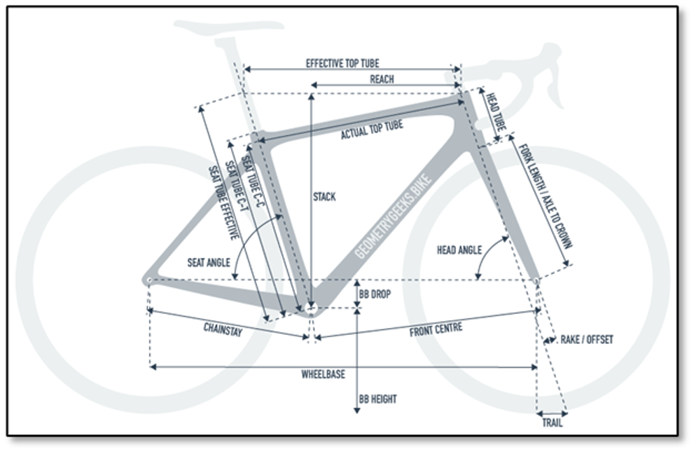

# MTB-Categorization-Analysis

For this project, our team will determine whether the specifications of mountain bikes (MTB) are enough to differentiate between the different types of mountain bike categories. 

Currently, full suspension mountain bikes come in multiple categories:

- **Cross Country (XC)** | Tend to be the most lightweight, nimble, and designed to put the rider in an efficient pedaling position 
- **Enduro** | Heavier frames, more travel and more downhill oriented geometry 
- **Trail** | The most common category of bikes, considered to be the halfway point between XC and Enduro
- **All Mountain** | A more niche category which some manufacturers claim to be more downhill focused than trail bikes, but not designed for downhill races like Enduro bikes are
- **Downcountry** | A relatively new category between XC and Trail. Similar to the All Mountain category, these bikes aren’t race specific like XC bikes tend to be, but are lighter and faster than trail bikes.

With all of the factors to consider when designing a bike, there are no clear boundaries between these categories. For example, one brand’s Downcountry bike could be what another brand considers a Trail bike. 

**The goal of our project is to determine how many, if any, discrete categories should exist for mountain bikes.** Since most specifications and geometric measurements have one direction when moving across the spectrum of bikes, it’s reasonable to believe that these measurements could be reduced to much fewer dimensions, and perhaps even one continuous principle component rather than discrete categories. Here is a diagram of some of the different types of geometric specifications on mountain bikes:

# Repository Structure
| Folder | Description |
| --- | --- |
| Code | This section includes all of the `R` code used for analysis. |
| Data | This section includes the main datasets used throughout the analyses. |
| Images | This section includes image outputs from the different analyses performed. |

# Data Source
Unfortunately, we have not been able to find one clean, concise dataset yet for this project. However, through sites like [mtbdatabase.com](mtbdatabase.com), [jensonusa.com](jensonusa.com), and bike manufacturer websites, we have been able to compile bike data including part specifications and geometry. So far, we have manually compiled the data corresponding to 50 bikes. We will attempt to use web scraping techniques to programmatically pull a much richer pool of MTB specifications. We feel that, even if limited to using manually-pulled data, we will be able to gain valuable insights. 

# Methodology
## Data Preparation
To begin, we will need to choose how to compare bikes across different sizes. Since each bike manufacturer sizes their bikes differently, one company’s medium might equate to another company’s large. For this reason, we will assume a male rider of average height and proportions, and use whichever size the manufacturer suggests for this height. 

Once the data is collected, we will apply a standard scaling to center the data about 0 with standard deviation of 1. This will ensure that features such as wheelbase, with values in the 1200 range, do not overshadow features like head angle, with values in the range of 60-70.

## Analysis
There are two approaches we can consider when analyzing this data. The first would be to consider the manufacturers’ labels of their own bikes, and develop a supervised learning model that can predict a new bike’s category given its features. This can be accomplished with a KNN or other classification algorithm. One drawback of this approach is mentioned above, in that brands could have different definitions of bike categories. Another risk of this approach is potential for class imbalance. If our dataset over emphasizes a specific category of bike, this could result in high variance when trying to predict labels on new bikes.

The second approach would be to strip all bikes of their labels, and treat our analysis as an unsupervised learning model. This may prove to be more insightful considering the risks above. We plan to use Gaussian Mixture Models and K-Means clustering algorithms to determine how many discrete categories of bikes should exist, and where in the hyperspace of bike features their centroids should lie. 

